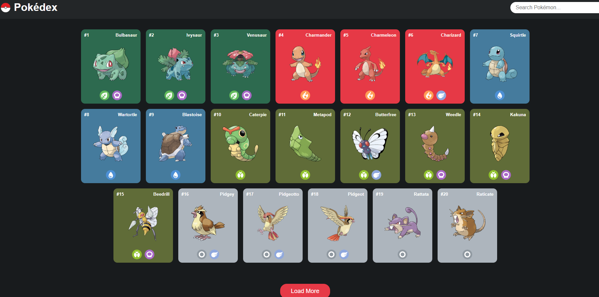

# 🐾 Pokédex – Interaktive Pokémon-Plattform

Eine responsive und moderne Pokédex-Webseite, die Daten live aus der offiziellen PokéAPI abruft. Die Anwendung bietet eine dynamische Suche, Detail-Dialoge mit Statuswerten und eine vollautomatische Evolutionskette.

🚀 Live Demo

👉 https://ismael-toumi.developerakademie.net/index.html

📸 Preview

🧩 Projektbeschreibung

Der Pokédex ist eine Single-Page-Anwendung, die hunderte Pokémon übersichtlich darstellt. Über eine REST-API werden die Daten asynchron nachgeladen, im Browser verarbeitet und visuell ansprechend aufbereitet.

Die Plattform bietet:
* Eine visuelle Übersichtskarte aller geladenen Pokémon
* Dynamische Hintergrundfarben passend zum Pokémon-Typ
* Ein modales Dialog-Fenster (Modal) für Detail-Ansichten
* Navigation innerhalb des Dialogs (Vor & Zurück)
* Live-Abfrage der kompletten Evolutionskette

✨ Features

🏠 Startseite / Übersicht
* Visuelle Pokémon-Galerie mit Typ-Icons
* Responsive Grid-Layout
* Asynchrones Nachladen von Daten (REST-API)

📊 Detail-Dialog (Stats)
* Anzeige der offiziellen Artworks
* Live-Berechnung und Darstellung der Basis-Statuswerte (HP, Attack, Defense, Speed)
* Sperren des Hintergrund-Scrollings bei geöffnetem Dialog

🧬 Evolutions-Kette
* Dynamisches Durchlaufen der verschachtelten API-Evolutionskette via Schleife
* Automatisches Nachladen aller Entwicklungsstufen (z.B. Bisasam → Bisaknosp → Bisaflor)
* Visuelle Trennung durch Richtungspfeile

📱 Responsive Design
* Desktop: Mehrspaltiges, breites Grid-Layout
* Tablet: Optimierte Karten-Anordnung
* Mobile: Touch-freundliche Buttons und zentrierte Dialog-Anzeige

🛠️ Verwendete Technologien
* HTML5 (Semantische Struktur, native `<dialog>`-Elemente)
* CSS3 (Flexbox, Grid-Layout, Custom Typ-Farben)
* Vanilla JavaScript (Modernes Async/Await, Fetch-API, native Array-Methoden wie `.map()` und `.join()`)
* PokéAPI (RESTful Pokémon API)

⚙️ JavaScript-Funktionalität

* **Optimierte API-Struktur:** Zerlegung komplexer asynchroner Abfragen in maximal 14 Zeilen lange, wiederverwendbare Hilfsfunktionen.
* **Dynamische DOM-Manipulation:** Generierung von HTML-Strukturen im Speicher ohne Komma-Rückstände durch `.join('')`.
* **Flexible Schleifen-Logik:** Sicheres Auslesen von beliebig langen Evolutionsketten ohne Festverdrahtung im Code.

🎯 Lernziele des Projekts
* Sicherer Umgang mit asynchronem JavaScript (`async/await` und `fetch`)
* Verarbeitung und Filterung von tief verschachtelten JSON-Objekten
* Dynamisches Rendern von HTML-Elementen basierend auf API-Daten
* Performance-Optimierung durch Speichertrennung statt String-Verschachtelung im HTML
